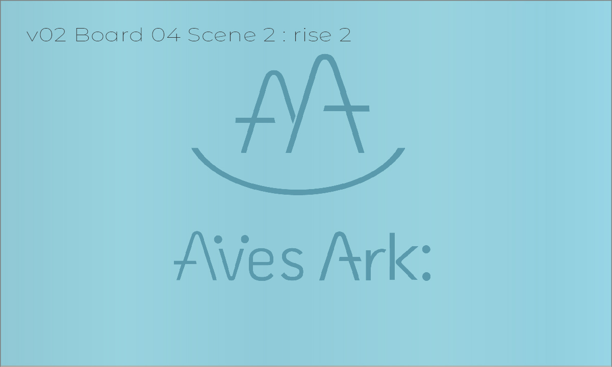
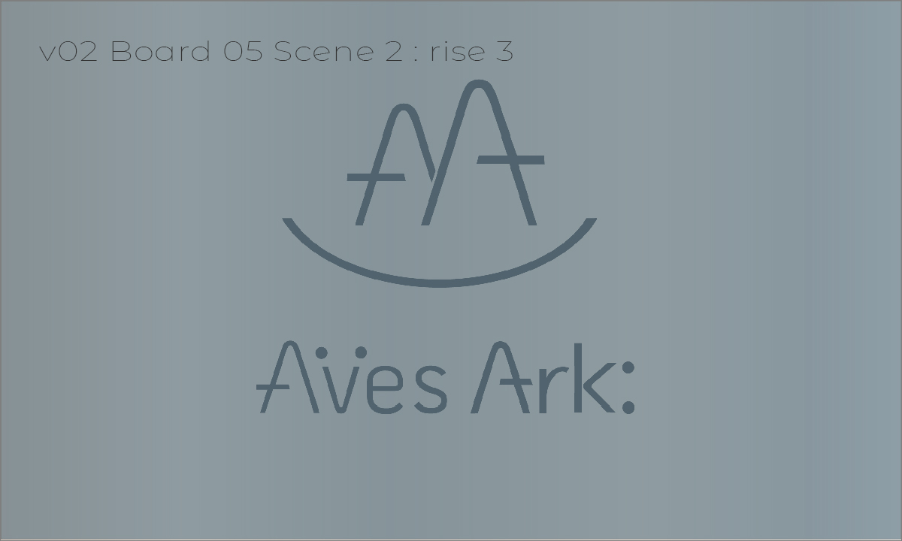
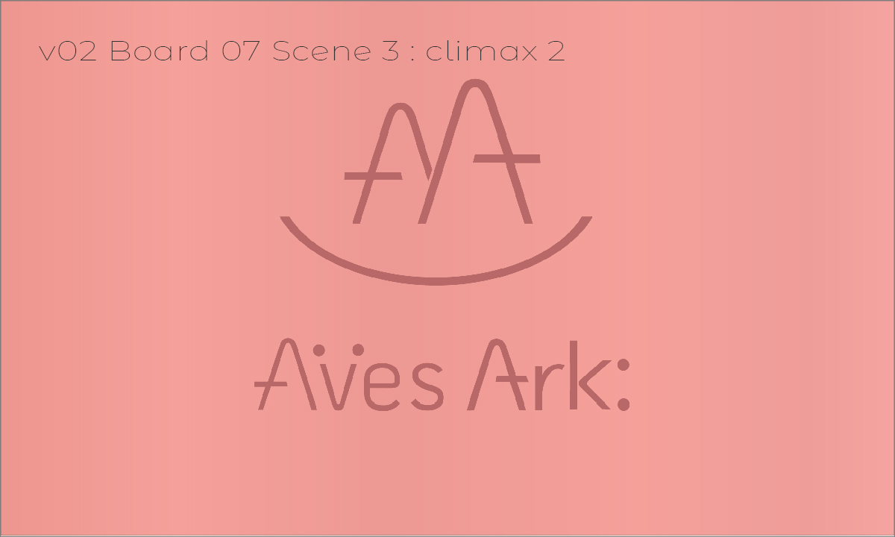
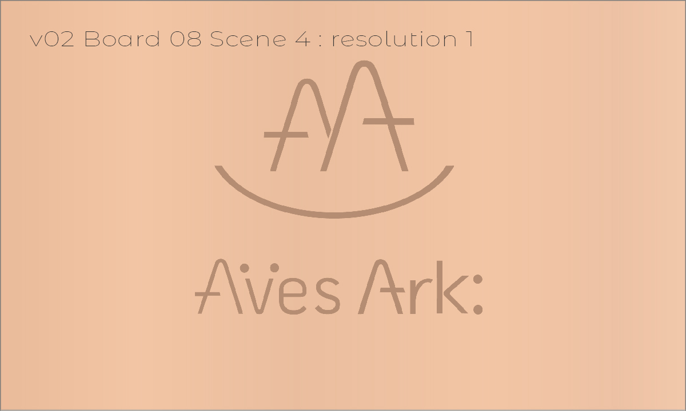
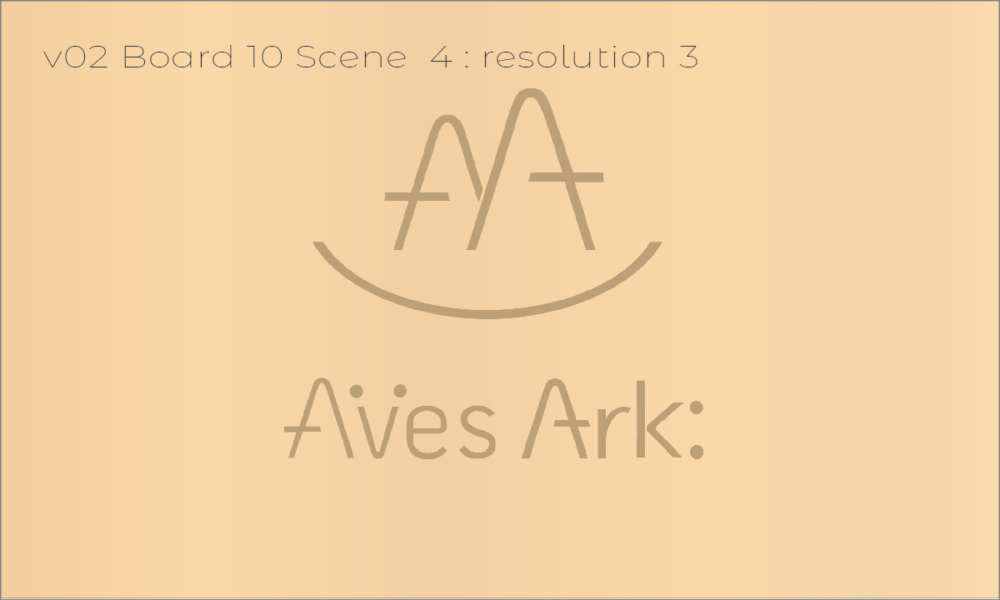
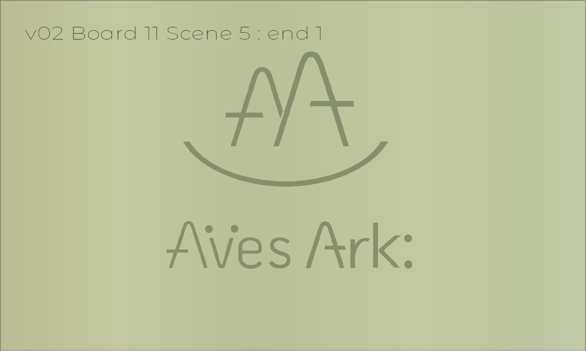

# Series: Aves Ark Launch Videos initial script drafts
## Video 02: *Habitat Threat Thread*
**Description:** Despite the efforts of so many concerned citizens of the world and this state, the threats to our birds are many and deadly

___

#### I. OPEN –> <–
|  |  |
| :----------------        |    :---------------:   |
| Scene: Habitat shoreline, egrets   |   |
| Action: Species categories | *Shots* Multiple, WS |   
| Sound: recorded audio birds in habitat | *Audio* Adjust volume for POV fx |
| Animation: tbd  | *Motivation* necessity vs beauty |
| Data: tbd  | *Type* tbd |

> Narration: Did you know there are fifty percent less birds on earth now than fifty years ago? [^1](http://)
> - Development has altered and destroyed much of the natural habitat particulaly for our shoreline birds
> - The importance of compromising how much land is designated for natural habitats for other species to survive and thrive is urgent. Awareness that there is even a problem seems less than urgent in the general public and media. There are many dedicated people who are aware and trying, but the task is as enormous as climate change. Have we gone too far, can we reverse course?
___

|  |  |
| :----------------        |    :---------------:   |
| Scene: Egrets in marsh    |   |
| Action: Habitat categories over salt marsh footage | *Shots* singles-etchings, FS |   
| Sound: tbd | *Audio* Adjust volume for POV fx |
| Animation: Categories of birds typography and icons | *Motivation* academic, informative  |
| Data: categorical data visualization | *Type* fade on animation and exit left   |

> Narration: Audubon priority species [2](https://ct.audubon.org/priority-bird-species)
> - Coastal birds, Salt Marsh birds, Wetland birds, Open Air and Open Water birds
> - Grassland birds, Shrubland birds, Woodland birds
> - There are losses in population and breeding pairs in all of these categories. 
> The data visualization finalized will determine specifics for narration.
___

#### TITLE: ***Habitat Threat Thread*** 
Sequence over footage from previous scene  
| **Title animation sequence**      | 
| :----------------  |
| Description ... | 
|  |
| Action: Panning habitat |  Video title **“types on”** over footage, swipe left exit |   
| Sound: Continue with natural audio | *Audio* Add Branding-Beat for series |
| Animation: Type on title name  | Hold 5 seconds  *Swipe off* |

> Narration: Improvement Movement : Helping birds in Connecticut

___

#### II. RISE + + +
|  |  |
| :----------------        |    :---------------:   |
| Scene: Shrubland footage  |   |
| Action: Species categories | *Shots* Single, FS |   
| Sound: Species specific | *Audio* Adjust volume for POV fx |
| Animation: tbd  | *Motivation* empathy |
| Data:  | *Type* tbd |

> Narration: Shrubland birds in danger [3](https://portal.ct.gov/DEEP/Wildlife/Habitat/Shrubland-Bird-Monitoring)
> - Describe the meaning of the priority species list, 
> - show and illuminate specific near threatened species and the specific habitat - **Shrubland birds** 
> The data visualization finalized will determine specifics for narration.

___

|  |  |
| :----------------        |    :---------------:   |
| Scene: footage grassland birds   |   |
| Action: Species categories | *Shots* WS, ES |   
| Sound: tbd | *Audio* Adjust volume for POV fx |
| Animation: tbd  | *Motivation* empathy |
| Data: tbd chart | *Type* tbd |

> Narration: Audubon priority species [4](http://)
> - Describe the meaning of the priority species list, 
> - show and illuminate specific near threatened species and the specific habitat - **Grassland birds** 
> The data visualization finalized will determine specifics for narration.
___

|  |  |
| :----------------        |    :---------------:   |
| Scene: ...   |   |
| Action: Species categories | *Shots* Single, FS |   
| Sound: tbd | *Audio* Adjust volume for POV fx |
| Animation: tbd  | *Motivation* emotion |
| Data: tbd chart | *Type* tbd |

> Narration: Audubon priority species [5](http://)
> - ... habitat specific
> - ... habitat specific
___

#### III. CLIMAX –> <–
|  |  |
| :----------------        |    :---------------:   |
| Scene: Parking lots, buildings, no trees, rooftops   |   |
| Action: Data animation | *Shots* Single, FS |   
| Sound: silence or power tools | *Audio* Adjust volume for POV fx |
| Animation: tbd  | *Motivation* emotion |
| Data: tbd chart | *Type* tbd |

> Narration: From the Science of Birds [6](https://www.scienceofbirds.com/blog/top-5-global-threats-to-bird-populations)
> - "North America has suffered a net loss of 30% of its birds. In other words, the total number of individual birds onthis continent is only two-thirds ofwhat it was just 50 years ago. That's 3 billion birds wiped out.
And this was at the hands of humans. There’s nothing natural about these declines." Ivan Phillipsen
___

|  |  |
| :----------------        |    :---------------:   |
| Scene: Mallards a personal favorite |  |
| Action: Mallards in various habitats | *Shots* Single, FS |   
| Sound: tbd | *Audio* Adjust volume for POV fx |
| Animation: tbd  | *Motivation* emotion |
| Data: tbd chart | *Type* tbd |

> Narration: Mallards seem common, expected, adored. We see less, even common species are facing threats. What happens when breeding slows for species of Least Concern? [7](http://)
> - p15-17 CT state of birds 2022 “The number of breeding pairs of Mallards has fallen in Connecticut. Breeding Mallards in New England are relatively stable, although data supplied by the Connecticut Department of Energy and Environmental Protection reveal that the three-year rolling average of nesting pairs in Connecticut fell by 34 percent from 2000 through 2020—from an average of 17,823 to 11,676.” Paul Schmidt  
> - If an amazingly adaptable species like Mallards, a dabbling duck are not thriving in a human centric world, how do we protect the tiny populations left of the delicate and rare? - **Many habitats** 
> The data visualization finalized will determine specifics for narration.
___
 

#### IV. RESOLUTION + + +
|  |  |
| :----------------        |    :---------------:   |
| Scene: Examining Specific Threats - Habitat Destruction  |   |
| Action: Species categories | *Shots* Single, FS |   
| Sound: tbd | *Audio* Adjust volume for POV fx |
| Animation: tbd  | *Motivation* emotion |
| Data: tbd chart | *Type* tbd |

> Narration: Audubon priority species [8](https://www.scienceofbirds.com/blog/top-5-global-threats-to-bird-populations)
> - Agricultural expansion
> - Logging/Deforestation
> - Invasive Species
> - Hunting and Trapping
> - Climate Change
___

|  |  |
| :----------------        |    :---------------:   |
| Scene: Mallard pair scoping nesting spot   |   |
| Action: Species categories | *Shots* Single, FS |   
| Sound: tbd | *Audio* Adjust volume for POV fx |
| Animation: tbd  | *Motivation* emotion |
| Data: tbd chart | *Type* tbd |

> Narration:  [9](http://)
> - ... habitat specific
> - ... habitat specific
___

|  |  |
| :----------------        |    :---------------:   |
| Scene: Woodland species   |   |
| Action: Yellow-breasted Chat -Endangered, | *Shots* Single, FS |   
| Sound: tbd | *Audio* Adjust volume for POV fx |
| Animation: Etching and data points  | *Motivation* emotion |
| Data: Species specific data chart | *Type* tbd |

> Narration: Audubon priority species [10](https://ct.audubon.org/priority-bird-species)
> - Endangered Woodland species in Connecticut like the Yellow-Breasted Chat
> - ... habitat specific data details
___

#### V. END –> <–
|  |  |
| :----------------        |    :---------------:   |
| Scene: Coastal Species  |   |
| Action: Least Tern | *Shots* Single, FS |   
| Sound: tbd | *Audio* Adjust volume for POV fx |
| Animation: tbd  | *Motivation* emotion |
| Data: tbd chart | *Type* tbd |

> Narration: Audubon priority species [11](http://)
> - ... Endangered Coastal species Least Tern
> - ... habitat specific data details
___

|  |  |
| :----------------        |    :---------------:   |
| Scene: Community action across multiple jurisdictions  |   |
| Action: Species categories | *Shots* Single, FS |   
| Sound: tbd | *Audio* Adjust volume for POV fx |
| Animation: tbd  | *Motivation* urgency |
| Data: tbd chart | *Type* tbd |

> Narration: Audubon priority species [12](https://mbjv.org/birds-habitats/)
> - "Experts have developed national and international conservation plans for waterfowl, landbirds, waterbirds,and shorebirds that defi ne conservation goals and objectives for priority species. In addition, Reports like theState of the Birds, State of Canada’s Birds, and Saving our Shared Birds highlight some of the majorchallenges facing bird conservation in North America today. Joint Ventures work with partners across NorthAmerican to help meet the goals and objectives of these conservation plans and address these challenges toensure a sustainable future for not just birds, but people, as well." Migratory Joint Ventures, *Birds & Habitats*
___

#### CREDITS: 
sequence over footage from previous scene  
| **Animation**      | 
| :----------------  |
| The scene from before zooms in for closeup, low contrast suited for animation drop | 
| **Credits sequence 3 movements** | 
|  |
| Action: Wetlands panning |  Video title **“types on”** over footage, swipe left exit |   
| Sound: Continue with natural audio | *Add Branding-Beat for series* |
| Animation: Above the Line credits  | Hold 5 seconds  **Rolling Order** References|
> Any dedications or extra thanks
> Narration: Tagline

___

*Final includes bottom frame Chyron logo play with video timeline*

#### Items to complete
- [x] Citations complete in script
- [ ] Citations updated in proposal
- [ ] Data specifics from research
- [ ] Specify footage sources
- [x] add to github

___

#### References

American Bird Conservancy (2022, October 12). 2022 U.S. State of the Birds Report Reveals Widespread Losses of Birds in All Habitats Except for One. Abcbirds.org. Retrieved July 19, 23, from https://abcbirds.org/news/2022-state-of-the-birds-press-release/ 2022-State-of-the-Birds-Policy-Insert 

Audubon Connecticut (n.d.). 2022 Shorebird and Seabird Conservation Highlights. Audubon Atlantic Flyway Connecticut. Retrieved July 17, 2023, from https://ct.audubon.org/news/2022-shorebird-and-seabird-conservation-highlights

Audubon | Connecticut National Audubon Society (2019, March 31). Priority Bird Species. Audubon » Atlantic Flyway Connecticut. Retrieved July 11, 2023, from https://ct.audubon.org/priority-bird-species 

Audubon.org. Retrieved June 8, 2023, from https://www.audubon.org/magazine/fall-2019/birds-are-telling-us-its-time-take-action-climate

Connecticut Audubon Society (2022, April 30). Annual Report 2022: Year in Review - The Connecticut Audubon Society. Ctaudubon.org. Retrieved July 19, 2023, from https://www.ctaudubon.org/annual-report-2022-year-in-review/  

mbjv.org (n.d.). Birds & Habitats Let’s Keep Common Species Common. Migratory Bird Joint Ventures Conserving Birds and Their Habitats Throughout North America. Retrieved July 19, 2023, from https://mbjv.org/birds-habitats/

Phillipsen, I. (2020, October 19). The Top 5 Threats to Bird Populations. Scienceofbirds.com. Retrieved July 19, 2023, from https://www.scienceofbirds.com/blog/top-5-global-threats-to-bird-populations

DEEP Wildlife in Connecticut - *Yellow-breasted Chat* Endangered 

Montz, J. (2021, December 7). With nearly one-third of birds gone from North America, Audubon is concerned about six species in CT. Ctpost.com. Retrieved June 8, 2023, from https://www.ctpost.com/news/article/With-nearly-a-third-of-birds-gone-from-North-16680601.php

Pennisi, E. (2019, September 19). Three billion North American birds have vanished since 1970, surveys show | Science | AAAS. Science.org. Retrieved July 19, 2023, from https://www.science.org/content/article/three-billion-north-american-birds-have-vanished-1970-surveys-show

Connecticut Department of Energy & Environmental Protection (2019, April 29). Shrubland Bird Monitoring. CT.gov DEEP. Retrieved June 2, 2023, from https://portal.ct.gov/DEEP/Wildlife/Habitat/Shrubland-Bird-Monitoring
___

*Type: Beat monster/editorial*

Markdown written with Sublime Text by Rose Mikan July 31, 2023

FYI The narration is roughed in for context and will be written from point of view of video not just the quotations in context
