# Series: Aves Ark Launch Videos initial script drafts
## Video 01: *Improvement Movement*
**Description:** The community efforts that have shown success with restoring bird populations and breeding encouragement in the State of Connecticut.
___

#### ACT: OPEN –> <–
|  |  |
| :----------------        |    :---------------:   |
| Scene: Sky raptor in flight | 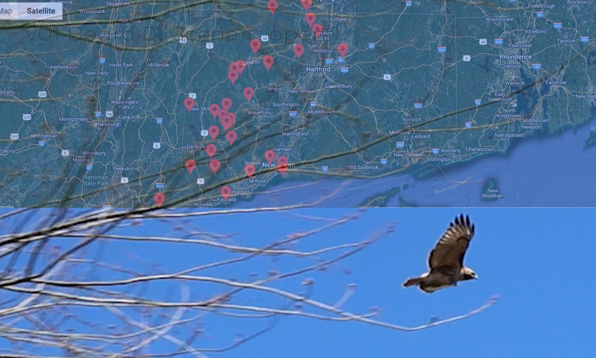  |
| Action: Fast moving bird in flight | *Shots* Single | Establishing |   
| Sound: Air moving fast with motion, possible slight raptor vocalization | *Audio* Adjust volume for POV fx |
| Animation: tbd   | *Motivation* free and wild |
| Data: DDT statistics | *Type* typography  |
 
> Narration: Reference specific documents @EPA2023 ... [1](http://epa.gov/caddis-vol1/case-ddt-revisiting-impairment)
> - Improvement to raptor population in the state of Connecticut after the devastating consequences of DDT from 1950- 1970, results from great community effort. 
> - The population losses enter data here ]

___
___

|  |  |
| :----------------        |    :---------------:   |
| Scene: Hawk early spring, sky match on action change species  | 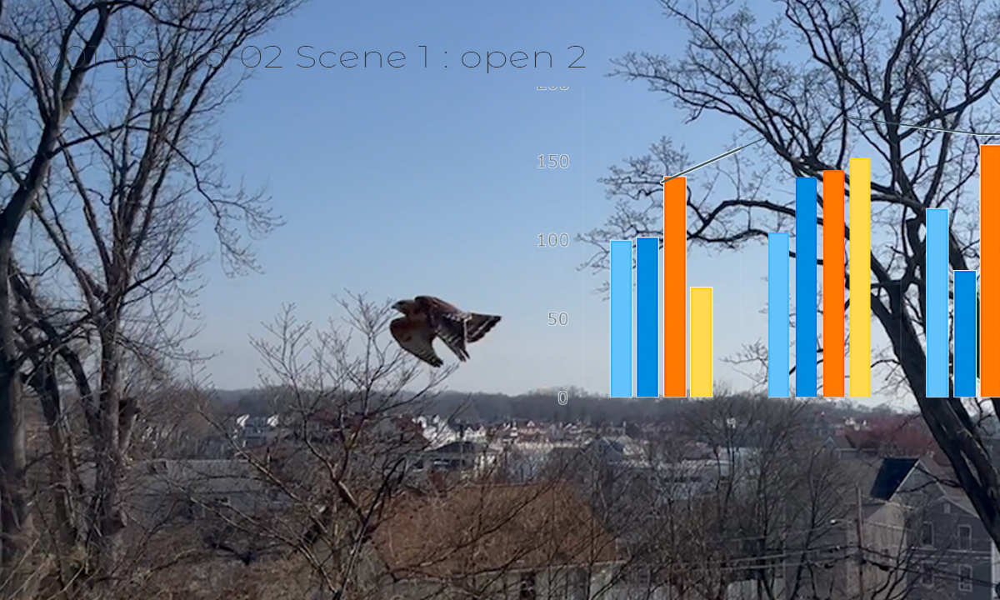  |
| Action: Flying picks up with another bird in flight | *Shots* Establishing |   
| Sound: Slight raptor vocalization, air motion sound | *Audio* Increase volume for POV fx |
| Animation: Typography with broad data statements  | *Motivation* knowledge|
| Data: Visualization to support the population numbers| *Type* chart micro movements, enter exit|

> Narration: Quote from the Connecticut Audubon's State of the Birds 2022 ... [2](https://www.ctaudubon.org/2022/12/connecticut-state-of-the-birds-2022-these-species-tell-the-story-of-conservation-over-125-years-and-point-to-the-issues-of-the-future/) 
> - The Audubon Connecticut Society and the Connecticut Audubon as well as The Connecticut Ornithological Association as well Osprey Nation and others have all contributed to healthy populations for
> - The population for Bald Eagles spans...
> - The population for Peregrin Falcons spans...
> - The population for Osprey spans...
>  Conservation efforts in our state and others have played important roles in protecting and nurturing birds and their fledglings.

___

#### Act: TITLE ***Improvement Movement*** 
sequence over footage from previous scene  
| **Title animation sequence**      | 
| :----------------  |
| The scene from before zooms out for open space  | 
|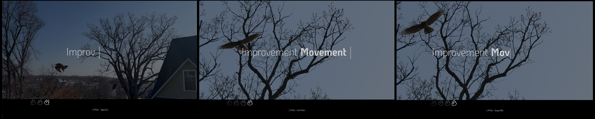  |
| Action: Panning to marshland with nest platforms and Conservation efforts |  Video title **“types on”** over footage, swipe left exit |   
| Sound: Continue with natural audio | *Audio* Add Branding-Beat for series |
| Animation: Type on title name  | Hold 5 seconds  *Swipe off* |

> Narration: Improvement Movement : Helping birds in Connecticut

___

#### Act: RISE + + +
|  |  |
| :----------------        |    :---------------:   |
| Scene: Osprey nests | 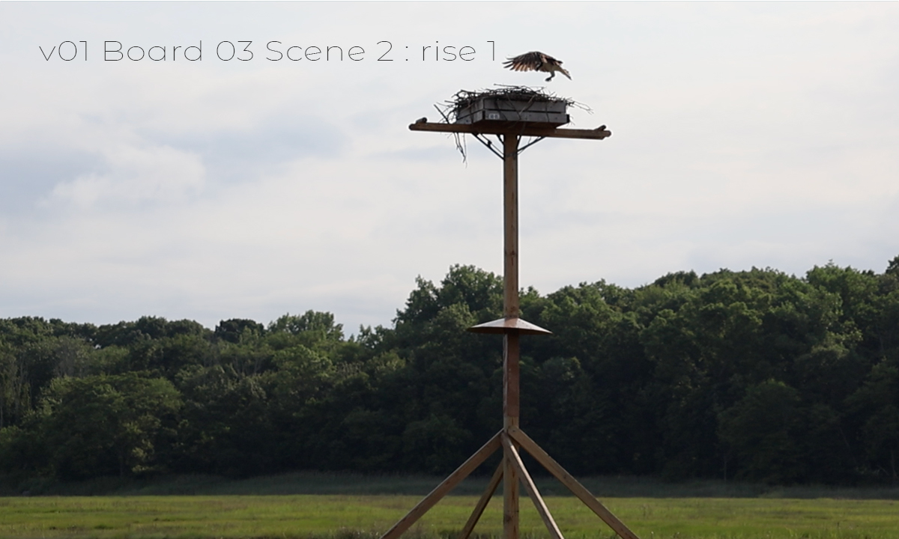  |
| Action: Osprey nests in protected marsh | *Shots* Single FS, low angle|   
| Sound: Osprey calls from footage | *Audio* Adjust volume for POV fx |
| Animation: tbd   | *Motivation* intimate|
| Data: Osprey Population figures|  *Type* bar chart |

> Narration: Next data document set [3](https://www.ctinsider.com/news/article/ct-audobon-state-of-the-birds-17621807.php) 
> - Ospreys, like other raptors, were harmed by the pesticide DDT after it came into
widespread use in the late 1940s. DDT weakened eggshells of many birds, cracking them
when parents sat on them to brood.
> - Ospreys also lost valuable nesting habitat due to
coastal development. “Lots of government agencies, conservation groups and individuals met their needs by putting up nesting platforms,” said Andersen. “The osprey population is now abundant and
seems stable in Connecticut. It’s just an amazing success story.”
___

|  |  |
| :----------------        |    :---------------:   |
| Scene: Osprey nest in Walmart parking lot  | 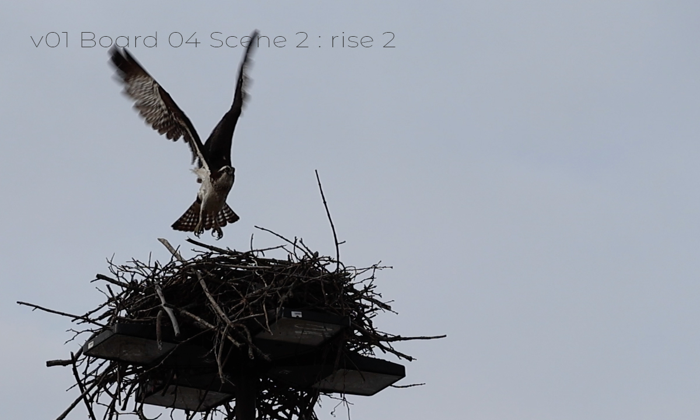  |
| Action: Busy nest |  *Shots* Two, FS,low angle |   
| Sound: Osprey recorded audio from footage | *Audio* Adjust volume for POV fx |
| Animation: tbd   | *Motivation* companionship |
| Data: tbd |  *Type* tbd |

> Narration: Osprey Nation success p.24 CT state of the birds 2021 [4](https://www.ctaudubon.org/osprey-nation-get-involved/) 
> - Osprey Nation project, propelled by 700 volunteers, 
> - has established a map of roughly 600 nest sites and a database 
> - of information about nesting success and fledglings. 
> - This information helps conservationists monitor the success 
> - of the burgeoning Osprey population.”
___

|  |  |
| :----------------        |    :---------------:   |
| Scene: Map of Osprey watch sights |   |
| Action: Osprey watchful away from nest| *Shot* Single |   
| Sound: Osprey fledglings and adults | *Audio* Adjust volume for POV fx |
| Animation: Data movement   |  *Motivation* Activism works |
| Data: Osprey Nation numbers |  *Type* spark line |
 
> Narration: Osprey Nation data report [5](https://www.ctaudubon.org/2015/04/osprey-nation-2014-final-report/) 
> - “Not only are they wonderful animals to study and observe, 
> - but Ospreys also provide an important indication of water quality 
> - and the health of our environment.”
___

#### Act: CLIMAX –> <–
|  |  |
| :----------------        |    :---------------:   |
| Scene: Bald Eagle | 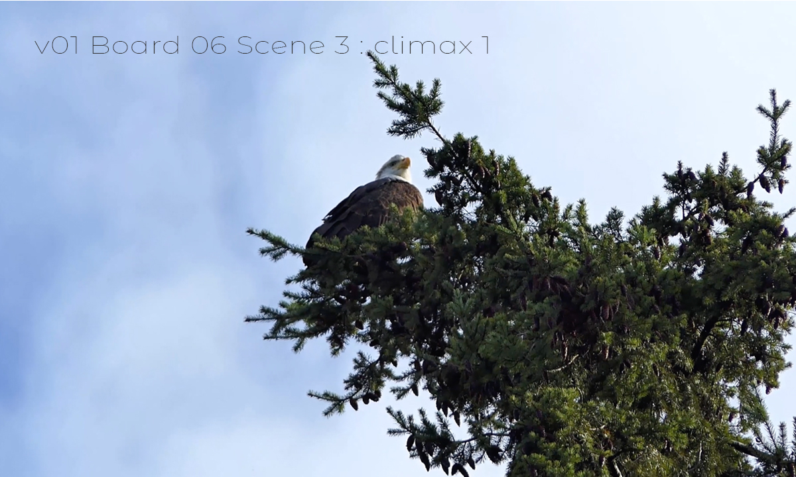  |
| Action: Bald eagle in tree | *Shots* Single,CU, Low Angle |   
| Sound: Air moving fast with motion, possible slight raptor vocalization | *Audio* Adjust volume for POV fx |
| Animation: Animate etching with data | *Motivation* bring success numbers in front  |
| Data: Focus on population changes overtime | *Type* tbd chart|

> Narration: Data talk [6]() 
> - Bald eagle 67 towns
> - Breeding statistics

___ 

|  |  |
| :----------------        |    :---------------:   |
| Scene: American Oystercatcher | 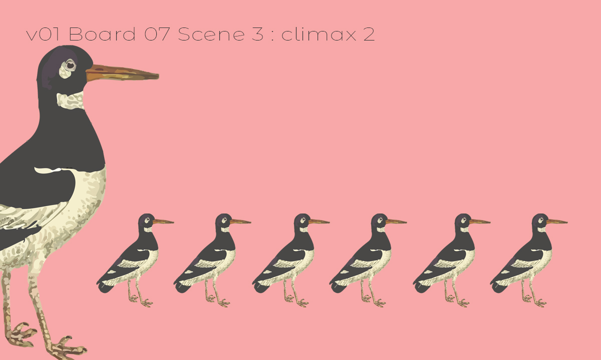  |
| Action: Quiet, meditative bird in tree RF and original footage Milford Point |  *Shots* WS, OTS |   
| Sound: Eagle vocalization from RF footage | *Audio* Adjust volume for POV fx |
| Animation: Numbers and chart etching of species  | *Motivation* Success|
| Data: Chart | *Type* tbd |

> Narration: Recovering America's Wildlife Act [7](https://abcbirds.org/news/2022-state-of-the-birds-press-release/ ) 
> - indicates the positives generated by the federal investment 
> - with the Recovering America's Wildlife Act amongst other 
> - Department of Energy and Environmental Protection in Connecticut 
> - can make a difference and should be supported by all citizens 
> - including business. The benefit is for all concerned. 
> - p8 CT state of birds 2022 For further insight into the 
> - breeding population, Audubon Connecticut, with support from partners, 
> - joined the efforts to color-band American Oystercatchers across the range. 
> - Since 1999, over 6,000 oystercatchers have been banded in the U.S. 
> - and Mexico. Banding birds helps researchers to better understand movements, 
> - habitat requirements, and survival.  

___

#### Act: RESOLUTION + + +
|  |  |
| :----------------        |    :---------------:   |
| Scene: American Oystercatcher   | 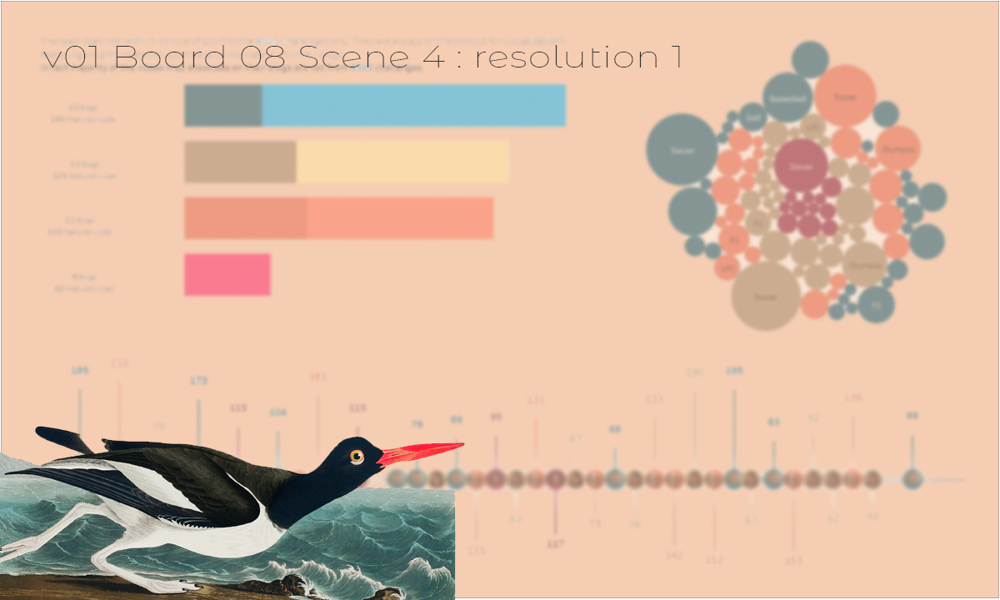  |
| Action: Slow beach footage, American Oystercatcher etching CC| *Shots* Single, CU, low angle |   
| Sound: RF species recorded sounds | *Audio* Moderate pacing and volume |
| Animation: Etching on timeline   | *Motivation* vulnerability |
| Data: Charts with timeline | *Type* type-on micro-animation |

> Narration: American Oystercatcher Working Group [8](https://amoywg.org/research-sites/connecticut/) 
> - Since 2011, the breeding population in Connecticut 
> - has increased from 46 breeding pairs to 
> - 79 breeding pairs in 2018.
> - American Oystercatcher breeding sites range from coastal beaches 
> - to offshore islands of varying size. 
> - The island sites make up 80% of the breeding sites and 
> - result in higher average productivity when compared to the mainland beach sites.

___

|  |  |
| :----------------        |    :---------------:   |
| Scene: Stratford Meadows Community Success   | 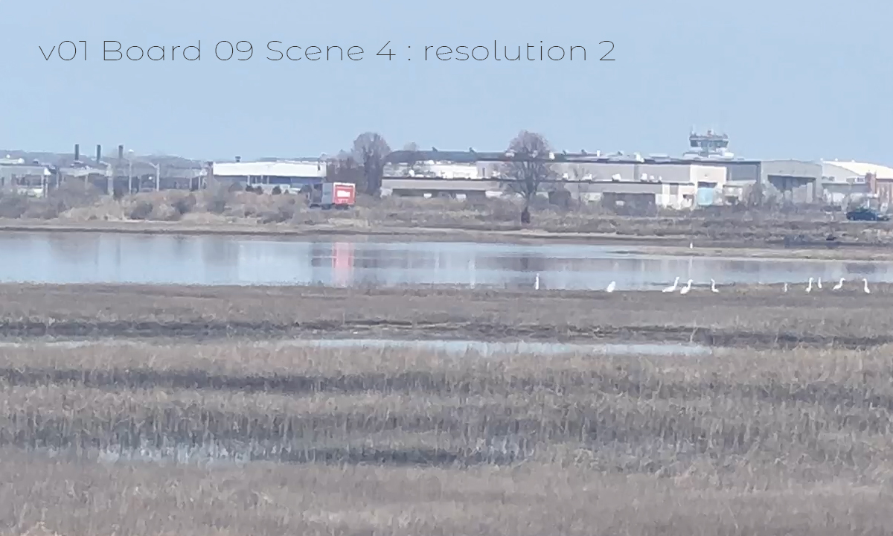  |
| Action: Establishing shot |  *Shots* Mix of species, WS |   
| Sound: Light beat, natural audio from footage recording | *Audio* Adjust volume for POV fx |
| Animation: Typography   | *Motivation* community action
| Data: tbd | *Type* tbd |

> Narration: Next data document set [9](https://ct.audubon.org/news/stratford’s-great-meadows-salt-marsh-gets-4m-refresh) 
> - "The Stewart B. McKinney National Wildlife Refuge and Great
Meadows Marsh protect our coast from the effects of climate change, while hopefully fostering
continued thoughts of environmental conservation for all of Connecticut,” said Joe Gresko,
House Chair of the Environment Committee and State Representative from Stratford.
"This is an incredible accomplishment resulting from the work of so many to restore and
revitalize the marsh, protect wildlife, rebuild ecosystems, and combat the effects of climate
change. To see this project completed with the restoration of 34 acres of salt marsh is
wonderful and transformative. This could not have been done without the 12 students from
Stratford and Bunnell high schools who worked as Salt Marsh Stewards, as well as their crew
leaders and over 150 volunteers who gave their time. Our entire community shares our deepest
gratitude with all who invested in this project to improve CT's coastline and give our beautiful
native plants and wildlife the ability to thrive. I look forward to visiting with my kids and
grandkids, and seeing future generations learn about the importance of protecting and
preserving our coastline and salt marsh," said Connecticut Senate Republican Leader Kevin
Kelly." 

___

|  |  |
| :----------------        |    :---------------:   |
| Scene: Connecticut legislation protected species  | 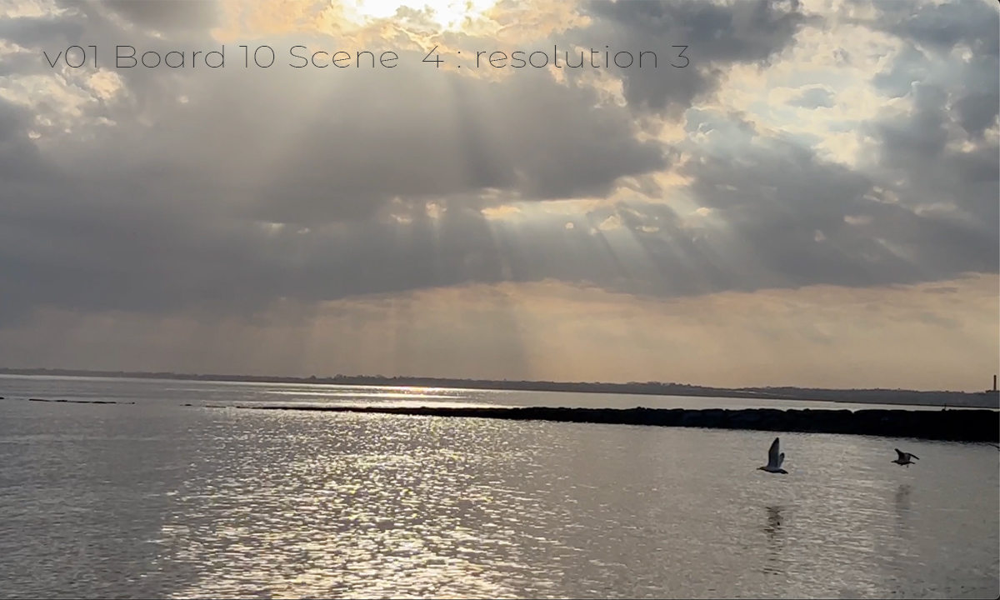  |
| Action: documents layering in on top of Osprey flying footage |  *Shots* Single, FS  |   
| Sound: Sound of paper and stacks hitting table | *Audio* fx to generate energy |
| Animation: typography   | *Motivation* serious, significant |
| Data: protected species names | *Type* appear/fade|

> Narration: p24 2021 CT State of the Birds:  [10](https://portal.ct.gov/DEEP/Endangered-Species/Endangered-Species-Listings/Endangered-Threatened--Special-Concern-Birds) 
> - Efforts to save the “grassland and shrubland birds 
> - among those in the greatest decline, Connecticut Audubon 
> - is working on habitat creation and restoration projects 
> - throughout the state’s Climate Stronghold areas.
> - Connecticut Audubon has been a leading advocate of 
> - land preservation investment, through the state’s 
> - Open Space and Watershed Land Acquisition Grant Program and Recreation 
> - and Natural Heritage Trust Program. 
> - We advocated for funding that in 2021 allowed the state to 
> - permanently protect 600 acres in Goshen near Croft Preserve.”

___

#### Act: END –> <–
|  |  |
| :----------------        |    :---------------:   |
| Scene: Greenways maps | 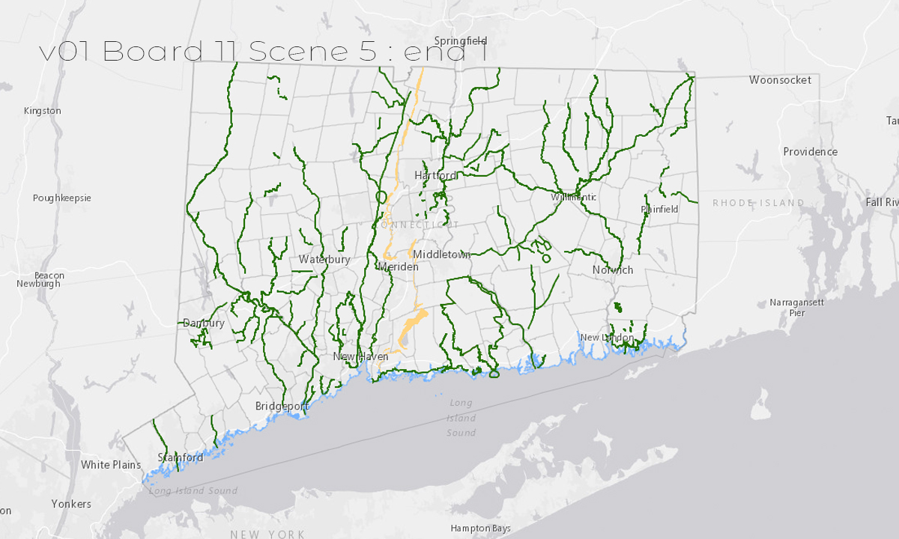  |
| Action: Montage of maps |  *Shots* Multiples, Montage |   
| Sound: general bird sounds, change with map location | *Audio* Adjust volume for POV fx |
| Animation: Typography and data viz appears   | *Motivation* bringing nature and humans together  |
| Data: List areas and years established with dendrogram data viz | *Type* Dendrogram |
 
> Narration: Next data document set [11](https://portal.ct.gov/DEEP/Outdoor-Recreation/Greenways/Official-Connecticut-Greenways) 
> - List block quote
> - list block quote 

___

|  |  |
| :----------------        |    :---------------:   |
| Scene: River footage   | 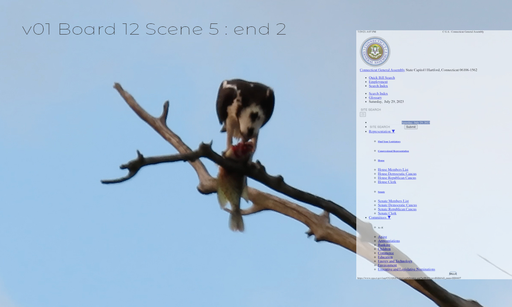  |
| Action: Easy like a Sunday morning | *Shots* Three, MS  |   
| Sound: woodland bird sounds | *Audio* soft volume |
| Animation: Data   | *Motivation* tbd |
| Data: Typography | *Type* tbd|
 
> Narration: Discuss legislation efforts [12](https://web.archive.org/web/20130415174417/) 
> - List categories of greenways and protected lands
> - Compatibility between human activity and bird activity

___

#### Act: CREDITS 
sequence over footage from previous scene  
| **Animation**      | 
| :----------------  |
| The scene from before zooms in for closeup, low contrast suited for animation drop | 
|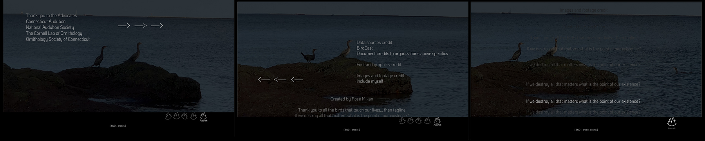  |
| Action: Flying picks up with another bird in flight |  Video title **“types on”** over footage, swipe left exit |   
| Sound: Continue with natural audio | *Audio* Add Branding-Beat for series* |
| Animation: Above the Line credits  | Hold 5 seconds  **Rolling Order** References|
> Any dedications or extra thanks

> Narration: Tagline

___

*Final includes bottom frame Chyron logo play with video timeline*

#### Items to complete
- [ ] Citations complete in script
- [ ] Citations updated in proposal
- [ ] Data specifics from research
- [ ] Specify footage sources
- [x] add to github

___

#### References

@EPA2023 says ... .
@EPA2023 [EPA (2023, June 27). The Case of DDT: Revisiting the Impairment. EPA United States Environmental Protection Agency. Retrieved July 29, 2023, from epa.gov/caddis-vol1/case-ddt-revisiting-impairment ]

@CTAud2022 from the state of the birds...
Anderson, T., Weston, C., Comins, P., Bull, M., Fusco, P. J., & Hough, J. (2022, December 1). Connecticut State of the Birds 2022: These Species Tell the Story of Conservation Over 125 Years, and Point to the Issues of the Future. Ctaudubon.org. Retrieved June 17, 2023, from ctaudubon.org/2022/12/connecticut-state-of-the-birds-2022-these-species-tell-the-story-of-conservation-over-125-years-and-point-to-the-issues-of-the-future/.

ctinsider.com/news/article/ct-audobon-state-of-the-birds-17621807.php

ctaudubon.org/osprey-nation-get-involved/

ctaudubon.org/2015/04/osprey-nation-2014-final-report/

abcbirds.org/news/2022-state-of-the-birds-press-release/

amoywg.org/research-sites/connecticut/

ct.audubon.org/news/stratford’s-great-meadows-salt-marsh-gets-4m-refresh

portal.ct.gov/DEEP/Endangered-Species/Endangered-Species-Listings/Endangered-Threatened--Special-Concern-Birds

portal.ct.gov/DEEP/Outdoor-Recreation/Greenways/Official-Connecticut-Greenways

web.archive.org/web/20130415174417/

___

*Type: Rebirth/editorial : happy ending*

Markdown written with Sublime Text by Rose Mikan July 30, 2023

FYI The narration is roughed in for context and will be written from point of view of video not just the quotations in context
