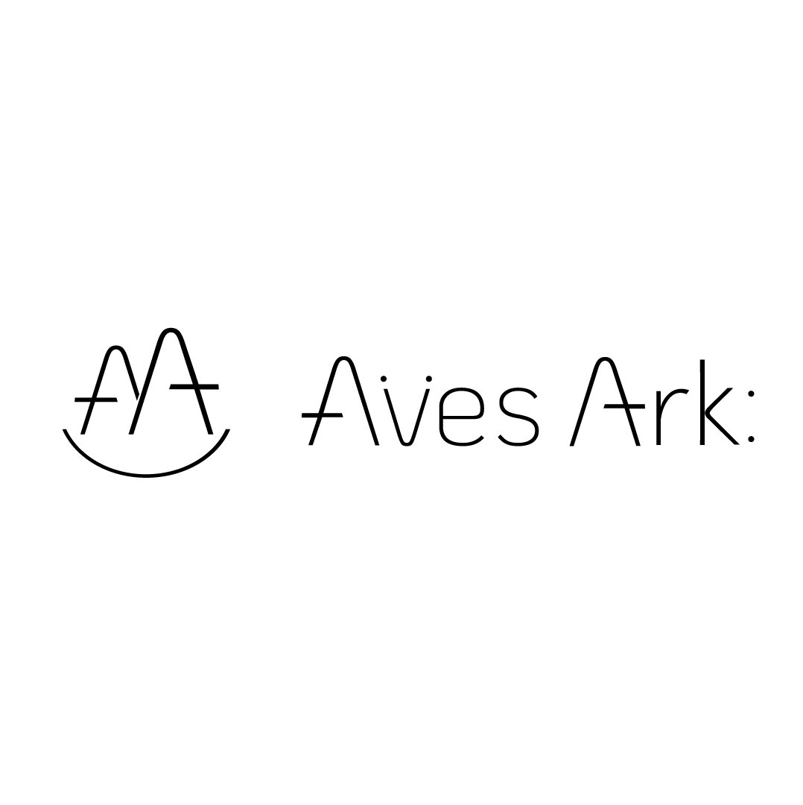

# Series Name
## Video 00 Title
Description: Script for
Type: one of seven types

### Scene    

| **Direction**      | **Visual** | 
| :---        |    :----:   |
> Description: Sky   |   |
> *Action*  Fast moving blank enters, 
> *Sound*  Foley from recorded audio
> *Narration* Reference specific documents [^1], 
>> narrative line 1 
>> narrative 2
>> narrative 3
>> narrative 4
>> narrative 5
> Data animation direction   | Shot ***Type*** |    
[^1](link to document or reference)   

1. First item
1. Second item
1. Third item
1. Fourth item the number doesn't matter will order them if start with 1.
   1. indented nested list
   2. seconded indented nested list item
5. List item
- unordered list only needs hyphen don't use asterik even though it works

** Fenced Code Blocks are best practice**
*** Specify with syntax highlighting with 3 backticks and specify language
```json
{
  "firstName": "John",
  "lastName": "Smith",
  "age": 25
}
```

Here's a simple footnote,[^1] and here's a longer one.[^bignote]

### Heading with brackets and hash for a custom ID to modify with CSS  {#custom-id}

```html
<h3 id="custom-id">How custom id shows up in html</h3>
```
Use a standard link to connect to IDs 
[Heading IDs](#heading-ids)


# Definition Lists
First Term
: This is the definition of the first term.

Second Term
: This is one definition of the second term.
: This is another definition of the second term.

```html
<dl>
  <dt>First Term</dt>
  <dd>This is the definition of the first term.</dd>
  <dt>Second Term</dt>
  <dd>This is one definition of the second term. </dd>
  <dd>This is another definition of the second term.</dd>
</dl>
```

## This is a checklist
- [x] Write the press release
- [ ] Update the website
- [ ] Contact the media

[https://www.markdownguide.org/extended-syntax/#fenced-code-blocks] (https://www.markdownguide.org/extended-syntax/#fenced-code-blocks)
`https://www.markdownguide.org/extended-syntax/#fenced-code-blocks`

Superscript^TM^
Subscript~v1~

Highlight text ^High^==LIGHTED==

```HTML
<sup>TM</sup> could substitute <sub>v1</sub>
^High^<mark>LIGHTED</mark>
```

## EMOJIS 
Just type description of emotion or icon between colons :tent: :joy:
this is so :nice: or you may copy and paste

## TABLES

| Syntax      | Description |
| ----------- | ----------- |
| Header      | Title       |
| Paragraph   | Text        |

### Alignment

| Syntax      | Description | Test Text     |
| :---        |    :----:   |          ---: |
| Header      | Title       | Here's this   |
| Paragraph   | Text        | And more      |

### Line Breaks within Table Cells

| Syntax      | Description |
| ----------- | ----------- |
| Header      | Title |
| Paragraph   | First paragraph. <br><br> Second paragraph. |


### Lists within Table Cells

| Syntax      | Description |
| ----------- | ----------- |
| Header      | Title |
| List        | Here's a list! <ul><li>Item one.</li><li>Item two.</li></ul> |


#### Table of Contents

- [Underline](#underline)
- [Indent](#indent)
- [Center](#center)
- [Color](#color)


** Link Targets
[https://www.markdownguide.org/hacks/#link-targets](https://www.markdownguide.org/hacks/#link-targets)
No space between square brackets and parenthesis for links there is no markdown syntax for targets must use html 
```html
<a href="https://www.markdownguide.org" target="_blank">Learn Markdown!</a>
```

## Images
To add an image, add an exclamation mark (!), followed by alt text in brackets, and the path or URL to the image asset in parentheses. You can optionally add a title in quotation marks after the path or URL.

 "Aves Ark logo"

[https://www.markdownguide.org/basic-syntax/#images-1](https://www.markdownguide.org/basic-syntax/#images-1)


To add to ReadMe.md for animated gif
<p align="center">
 
</p>

Characters You Can Escape [https://www.markdownguide.org/basic-syntax/#characters-you-can-escape](https://www.markdownguide.org/basic-syntax/#characters-you-can-escape)
You can use a backslash to escape the following characters.

Character   Name
\  backslash
`  backtick (see also escaping backticks in code)
*  asterisk
_  underscore
{ }   curly braces
[ ]   brackets
< >   angle brackets
( )   parentheses
#  pound sign
+  plus sign
-  minus sign (hyphen)
.  dot
!  exclamation mark
|  pipe 

### (&#124;) Pipeline character
You can display a pipe (|) character in a table by using its HTML character code (&#124;).

- Copyright (©) — &copy;
- Registered trademark (®) — &reg;
- Trademark (™) — &trade;
- Euro (€) — &euro;
- Left arrow (←) — &larr;
- Up arrow (↑) — &uarr;
- Right arrow (→) — &rarr;
- Down arrow (↓) — &darr;
- Degree (°) — &#176;
- Pi (π) — &#960;
- [https://en.wikipedia.org/wiki/List_of_XML_and_HTML_character_entity_references](https://en.wikipedia.org/wiki/List_of_XML_and_HTML_character_entity_references)

