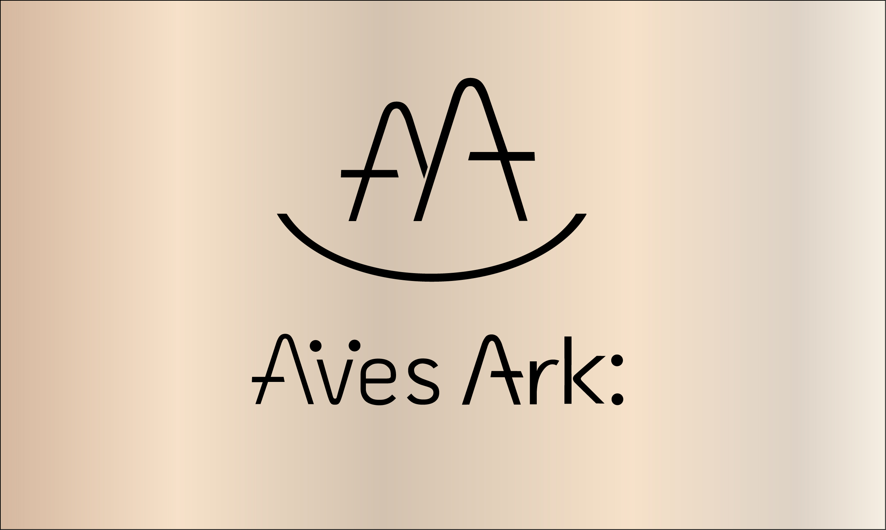

# Series Name
## Video 00 Title
Description: Script for
Type: one of seven types

### Scene name  

| **Direction**      | **Visual** | 
| :----------------        |    :---------------:   |
| Description: Sky and lots of words that expand responsively might need to specify size of image.   |   |
| *Action*  Fast moving blank enters, |  Shot ***Type*** |   
| *Sound*  Foley from recorded audio | *FX* |
| Data animation direction   | Shot ***Type*** |
> *Narration* Reference specific documents [^1], 
- narrative line 1 
- narrative 2
-  narrative 3
- narrative 4
- narrative 5

[^1](http://avesark.com)   

1. First item
1. Second item
1. Third item
1. Fourth item the number doesn't matter will order them if start with 1.
   1. indented nested list
   2. seconded indented nested list item
5. List item
- unordered list only needs hyphen don't use asterik even though it works

** Fenced Code Blocks are best practice**
*** Specify with syntax highlighting with 3 backticks and specify language
```json
{
  "firstName": "John",
  "lastName": "Smith",
  "age": 25
}
```
***Some other useful markdown syntax***
Here's a simple footnote,[^1] and here's a longer one.[^bignote]

### Heading with brackets and hash for a custom ID to modify with CSS  {#custom-id}

```html
<h3 id="custom-id">How custom id shows up in html</h3>
```
Use a standard link to connect to IDs 
[Heading IDs](#heading-ids)


### Definition Lists
First Term
: This is the definition of the first term.

Second Term
: This is one definition of the second term.
: This is another definition of the second term.


## This is a checklist
- [x] Write the press release
- [ ] Update the website
- [ ] Contact the media

Superscript^TM^
Subscript~v1~

Highlight text ^High^==LIGHTED==


## EMOJIS 
Just type description of emotion or icon between colons :tent: :joy:
this is so :nice: or you may copy and paste


#### Table of Contents

- [Underline](#underline)
- [Indent](#indent)
- [Center](#center)
- [Color](#color)


You can display a pipe (|) character in a table by using its HTML character code (&#124;).

- Copyright (©) — &copy;
- Registered trademark (®) — &reg;
- Trademark (™) — &trade;
- Euro (€) — &euro;
- Left arrow (←) — &larr;
- Up arrow (↑) — &uarr;
- Right arrow (→) — &rarr;
- Down arrow (↓) — &darr;
- Degree (°) — &#176;
- Pi (π) — &#960;

